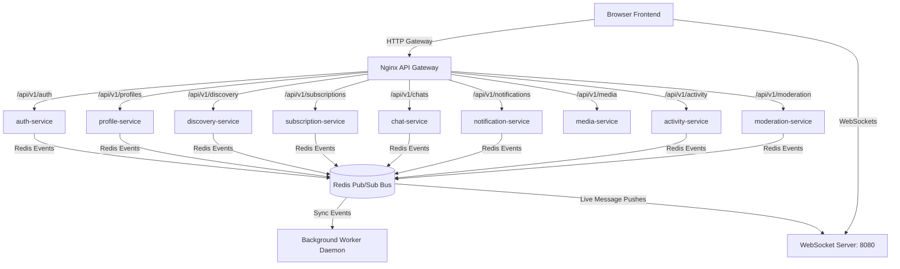

# Proud Hearts 💖 — LGBTQ+ Matrimony Platform (Slim 4 Microservices)

A high-fidelity, complete LGBTQ+ Matrimony Web Platform built using a decoupled **9-Microservices PHP (Slim 4) architecture**. It utilizes Nginx as an API Gateway, Redis as a Pub/Sub event bus, Ratchet for real-time WebSockets (messaging/typing indicators/receipts), and Eloquent ORM.

## System Architecture



---

## Technical Specifications

### 1. Color Palette (Strictly Applied)
- **Page Background**: `linear-gradient(135deg, #FFF1F6 0%, #FFE4EC 50%, #F8EEFF 100%)`
- **Primary Buttons**: `#F48FB1`
- **Hover Styles**: `#ec7ca4`
- **Design Aesthetic**: Glassmorphism (`backdrop-filter: blur(12px)`), clean cards, and micro-animations.

### 2. Access Control Tier Rules
- **Unauthenticated**: Landing, Login, and Registration pages only.
- **Free Account**: Can browse matches. Profile attributes, bio description, images, and contact fields are locked and blurred. Direct chat and expressing interests is disallowed (prompts Premium CTA upgrade).
- **Premium Account**: Unlocks full unblurred profiles, sends likes/interests, starts real-time chats, and filters search feeds by specific city and intent.
- **Admin**: Accesses the central moderation review queue to dismiss user flags or suspend accounts.

---

## Directory Index

```
.
├── docker/
│   ├── Dockerfile             # Base PHP-FPM 8.2 Alpine
│   ├── Dockerfile.websocket   # Base PHP-CLI 8.2 Alpine
│   └── init-db.sql            # Automatically instantiates 9 service schemas
├── frontend/
│   ├── public/
│   │   └── index.php          # Frontend Router Page
│   └── views/                 # Tailwind Styled Dashboard views
├── services/
│   ├── auth-service/          # Login, Signups, JWT blacklists
│   ├── profile-service/       # Pronoun preference, Gender Identity details
│   ├── discovery-service/     # Compatibility match feeds and criteria searching
│   ├── subscription-service/  # Payment processing and Gateway webhook calls
│   ├── chat-service/          # Message histories and read receipts logs
│   ├── notification-service/  # In-app indicators, SMTP, FCM mock actions
│   ├── media-service/         # GD Image uploads and compressions
│   ├── activity-service/      # Profile viewer activities & interest indicators
│   ├── moderation-service/    # Reporting, Blocking, & Admin lists
│   └── worker.php             # Event bus loop listener coordinating microservices
├── shared/                    # Bootstrappers, token managers, middlewares
├── websocket/
│   └── server.php             # Ratchet server file connecting connections and Redis channels
├── docker-compose.yml         # Container mapping config
├── nginx.conf                 # Gateway Router maps
└── composer.json              # Autoload maps & composer packages
```

---

## Quick Start Setup

### Prerequisites
- Docker & Docker Compose
- Composer (locally if building vendors outside containers, or let Docker run it)

### Step 1: Run Dependency Installer
Run composer to install Slim, JWT, Eloquent, and Predis dependencies:
```bash
composer install
```

### Step 2: Configure Environment
Copy `.env.example` to `.env` (pre-configured to connect inside docker container hosts):
```bash
cp .env.example .env
```

### Step 3: Run Containers
Spin up the MySQL database, Redis, Nginx, the Ratchet WebSocket server, the Event worker, and the FPM service endpoints:
```bash
docker-compose up --build -d
```

On first run, the services will:
1. Initialize the MySQL server.
2. Create 9 separate databases for each microservice (`matrimony_auth`, `matrimony_profile`, etc.) via `docker/init-db.sql`.
3. Auto-build all service schemas and seed a default Administrator:
   - **Admin Email**: `admin@lgbtqmatrimony.local`
   - **Admin Password**: `AdminSecure2026!`

### Step 4: Access Application
Open your browser and navigate to:
[http://localhost:4111](http://localhost:4111)

---

## Verification Testing Guides

### 1. Live WebSockets
Log in as a Premium User (register an account, go to subscription, mock a check payment, re-login to update credentials). Open the `/chat` panel or inspect the browser dev console. It connects to the API Gateway at `ws://localhost:4111/ws/` which proxies directly to the Ratchet container on port `8080`.

### 2. Event-Driven Messaging
When User A views User B's profile, the profile-service publishes a `profile.viewed` event. The background `worker` daemon catches this, writes the activity row, and broadcasts a live WebSocket notification so that User B immediately receives a toast alert.

### 3. Stripe & Razorpay Checkout Integration
Click "Upgrade" on the navbar, select Stripe or Razorpay, and click a plan. It redirects you to a mock sandbox payment terminal. Clicking "Authorize" runs a simulated payload callback matching the payload structure of gateway endpoints to `/api/v1/subscriptions/webhook`.
